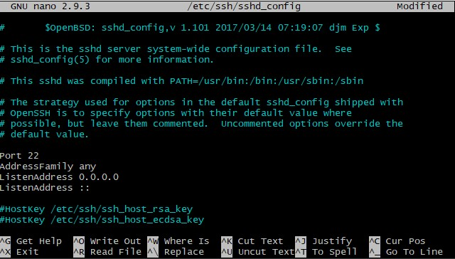
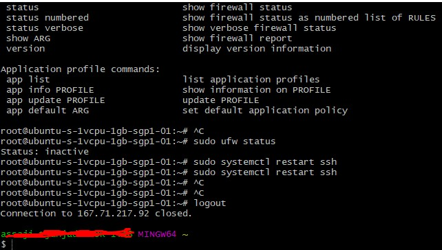
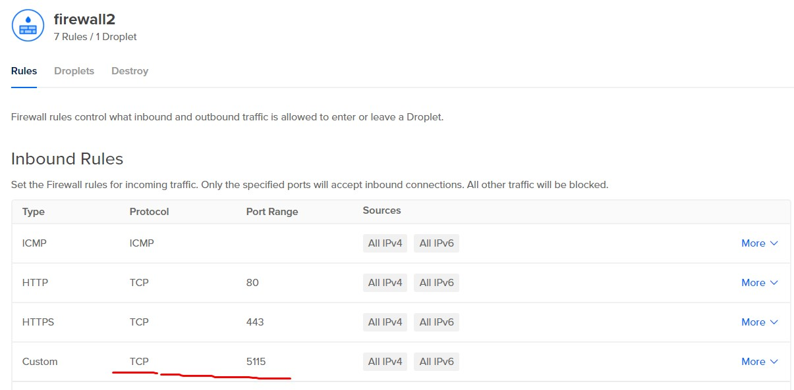

# dropletForDummies
A guide to create a droplet on Digital Ocean with LEMP Stack + Laravel project for Ubuntu User, assuming a droplet has been deployed and you know how to do ssh :)

## Change SSH port
After you managed to connect to your droplet, you should change port number of ssh, because port 22 is very obvious.
you could look at this link https://www.cyberciti.biz/faq/howto-change-ssh-port-on-linux-or-unix-server/

Find sshd config file

`$ find / -name "sshd_config" 2>/dev/null`

I personally prefer to use nano for editing, but vi/vim is also doable, on recent ubuntu droplet nano is already installed. But if you dont have it and you want to install:

`sudo apt install nano`

change the settings

`sudo nano /etc/ssh/sshd_config`

change port 22 to any number higher than 1024 and below 65535, I changed it to 5115

There is no need to configure the firewall because it is inactive, but if you are curious you can do this

`sudo ufw status`

All you have to do is to restart the ssh service

`sudo systemctl restart ssh`

and to logout from current ssh connection you can do 
`logout`

Don't forget to set your firewall.. I think on default there is no firewall (uh.. i forgot what was it like at first time), but you to make sure that you have firewall configured properly on your digital ocean control panel

...to be continue

